# PULSAR-ASM

**Ternary-model inference: Bonsai checkpoints on CPU, Gemma-3 on a Pi.**
The demo line is Bonsai — `Ternary-Bonsai-8B` (2.18 GB) and
`Ternary-Bonsai-2-27B` (7.21 GB) running on a DGX Spark, CPU-only, through
the C + NEON port in `pulsar_arm/bonsai2/` (greedy streams identical to the
reference server, token for token). The original asm engine is still here
unchanged: pure-assembly Gemma-3 inference on a Raspberry Pi 4 — one static
AArch64 binary, direct `svc` syscalls, no libc, no CRT, no third-party code,
with the tokenizer, sampler, chat REPL and whole forward pass in
`pulsar_arm/asm/core.S`.

Two checkpoints run unmodified on the Spark port, whose dimensions come from
the GGUF header so one binary covers each family:

| checkpoint | hidden | intermediate | layers | bytes | decode |
|---|---|---|---|---|---|
| `Ternary-Bonsai-2-27B-PTQ1_0` | 5120 | 17408 | 64 | 5.95 GB | **~0.10 s/token** (9.7 tok/s decode, 8 threads) |
| `Ternary-Bonsai-8B-PQ2_0` | 4096 | 12288 | 36 | 2.18 GB | **~35 ms/token** (28 tok/s, 6 threads; ~0.21 s/token on a phone) |

Three gemma checkpoints run unmodified on the Pi engine, which reads its
dimensions from the safetensors header, so one binary covers all of them:

| checkpoint | hidden | intermediate | layers | bytes/token | decode |
|---|---|---|---|---|---|
| `google/gemma-3-1b-it-qat-q4_0-unquantized` | 1152 | 6912 | 26 | 2.00 GB | **~543 ms/token** (1.8 tok/s) |
| `google/gemma-3-270m-it-qat-q4_0-unquantized` | 640 | 2048 | 18 | 536 MB | ~147 ms/token (6.8 tok/s) |
| `google/functiongemma-270m-it` | 640 | 2048 | 18 | 536 MB | same as 270m |

## At a glance

| | |
|---|---|
| Target | Raspberry Pi 4, Cortex-A72 / NEON only (no SVE, no dotprod), 3 cores — for gemma; DGX Spark, 20 Cortex-X925 cores, CPU-only — for Bonsai |
| Engine | one static binary: `as` + `ld`, direct syscalls, zero dependencies (gemma); C + NEON + OpenMP in `pulsar_arm/bonsai2/` (Bonsai) |
| Bandwidth | ~3.6–3.9 GB/s of a measured 3.93 GB/s streaming ceiling (92–98 %) |
| Parity | greedy output identical to transformers, token for token (1B bf16, 270m fp32); greedy Bonsai streams identical to the reference server, token for token (27B 17/17, 8B 5/5), plus a full top-20 distribution match |
| Determinism | fixed seed ⇒ byte-identical transcripts across runs |

## Quick start

```sh
# 1. build the engine
cd pulsar_arm/asm
as -o core.o core.S && ld -static -o core core.o

# 2. tokenizer blobs, once (the gemma-3 checkpoints share one tokenizer)
python3 ../tools/mkvocab.py <tokenizer.json> vocab.bin   # surfaces + byte fallback
python3 ../tools/mkbpe.py   <tokenizer.json> bpe.bin     # 514,906 merge rules

# 3. greedy bench: 8-token prompt, 32 decode steps, ids + ms/token
./core gemma-3-270m-it-qat-q4_0.safetensors vocab.bin
./core gemma-3-1b-it-qat-q4_0.safetensors   vocab.bin

# 4. chat REPL (needs bpe.bin)
./core gemma-3-1b-it-qat-q4_0.safetensors vocab.bin 2 c bpe.bin 1000 950 48

# 5. file mode: raw prompt on stdin, greedy, one shot (needs bpe.bin)
./core functiongemma-270m-it.safetensors fcvocab.bin 2 f fcbpe.bin 1000 950 16 < prompt.txt
```

`functiongemma-270m-it` uses its own `fcvocab.bin` / `fcbpe.bin`, built from its
own `tokenizer.json` with the same two tools.

## Bonsai quick start (aarch64 with ARMv8.2+dotprod, e.g. the Spark)

```sh
cd pulsar_arm/bonsai2
LB=<llama.cpp>/build/bin   # fork libs, quantization helpers + oracles only
python3 sign_extract.py Ternary-Bonsai-2-27B-PTQ1_0.gguf  # -> /tmp/sign{5120,6144,17408}.bin
# 27B engine:
gcc -O2 -fopenmp -march=armv8.2-a+dotprod -DTQ_XGEMV_LIB -Dmain=tq_neon_main \
  -c tq_gemv_neon.c -o fwd_neon_mt.o
gcc -O2 -fopenmp -march=armv8.2-a+dotprod -c fwd.c -o fwd.o
gcc -O2 -fopenmp -o fwd fwd.o fwd_neon_mt.o fwht.S \
  -L$LB -lggml-base -lggml-cpu -Wl,-rpath,$LB -lm
# prompt ids from the checkpoint's own template + tokenizer:
./tokdetok tokstr Ternary-Bonsai-2-27B-PTQ1_0.gguf <prompt words...>
# greedy (deterministic, the reference behaviour) then sampled:
OMP_NUM_THREADS=20 ./fwd Ternary-Bonsai-2-27B-PTQ1_0.gguf <ids...> --gen 200
OMP_NUM_THREADS=20 ./fwd Ternary-Bonsai-2-27B-PTQ1_0.gguf <ids...> --gen 200 \
  --sample 0.5 0.85 20 <seed> 0.05
```

The sampler follows the fork chain order (top-k → top-p → min-p on raw
logits, temperature scale last); the server default min-p is 0.05. The 8B
engine builds the same way from `pq2_gemv.c` + `fwd8.c` (no sign tables —
that checkpoint carries no Hadamard transform).

## Modes and flags

```
./core <model.safetensors> <vocab.bin> [tok] [mode] [bpe.bin] [temp_milli] [topp_milli] [gencap]
```

| arg | meaning |
|---|---|
| `tok` | token id for the startup layer-0 signature self-test (the bench prompt itself is built in) |
| `mode` | `0` greedy bench (default) · `1` sampled bench · `c` chat REPL · `f` file mode |
| `bpe.bin` | required by `c` and `f` |
| `temp_milli` | sampling temperature ×1000 (default 1000, min 50) |
| `topp_milli` | top-p ×1000 (default 950) |
| `gencap` | max generated tokens (default 128, max 400) |

Sampling follows the model card: temperature 1.0, **top-k 64**, top-p 0.95
(min-p 0), which is what the sampler implements. Measured guidance beyond that:
keep temp ≥ 0.7 (0.5 degenerates into token loops), top-p is neutral here
(0.5 / 0.95 / 1.0 all stay diverse), and gencap bounds output cleanly. The chat template (SOT/EOT roles) is verified id-exact
against HF, and every run prints its prefill ids as `tpl:` for transparency.

## Demos

Real runs, nothing re-typed: prompt, `tpl:` ids and response are the engine's
own bytes, the status bar carries that session's measured rate, and the amber
`>` line is the user turn (in the FunctionGemma clips it is the user message
inside the prompt file — file mode does not echo it, so the status bar names
the file). The two FunctionGemma clips also show the system turn verbatim, i.e.
where the tool is defined. All frames share one font size (17) and one
typeface — DejaVu Sans Mono, with WenQuanYi Zen Hei used only for the CJK
glyphs DejaVu lacks, at the same size and line height. Only pacing is
libertied. The set opens with Bonsai — ternary checkpoints, each shown in
English and Traditional Chinese on the same four-seasons ceiling prompt the
gemma clips use. Those four clips are the engines' own bytes (notes under
them); everything after is the same asm engine's own bytes — the K2-Horizon
pair on the phone, the gemma and FunctionGemma clips on the Pi.

**Ternary-Bonsai-8B** — 1.58-bit ternary, Qwen3-8B base, Qwen3
sampling (temp 0.6, top-p 0.95, top-k 20). 2.18 GB. These two clips are
the native engine (`pulsar_arm/bonsai2/`), running on a phone — Galaxy
Note 10+ (Snapdragon 855), 4 big cores, no GPU: 4.7 tok/s en, 4.0 tok/s
zh-TW. The same seeds rerun byte-identical on the Spark, so the
transcripts below are both machines' bytes at once.

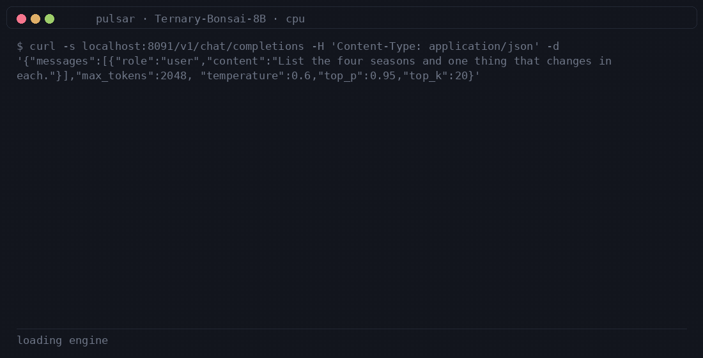
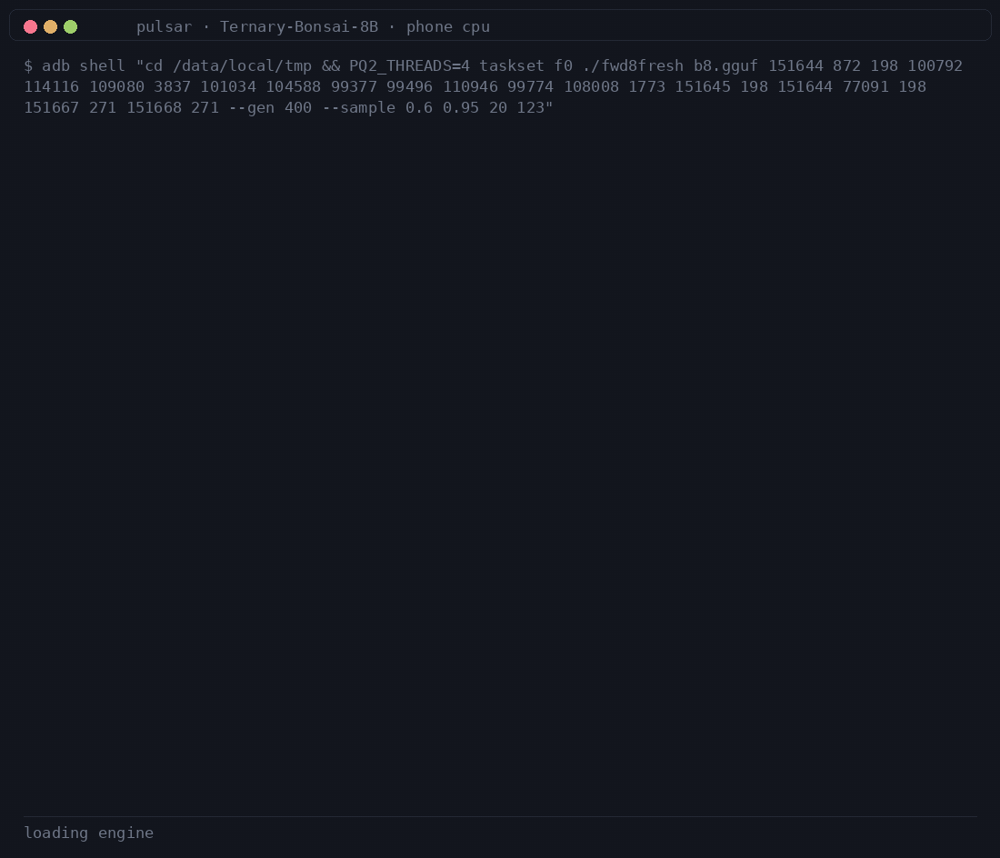

```sh
adb shell "cd /data/local/tmp && PQ2_THREADS=4 taskset f0 ./fwd8fresh b8.gguf 151644 872 ... --gen 400 --sample 0.6 0.95 20 7"  # en
adb shell "cd /data/local/tmp && PQ2_THREADS=4 taskset f0 ./fwd8fresh b8.gguf 151644 872 ... --gen 400 --sample 0.6 0.95 20 123"  # zh-TW
```

**Ternary-Bonsai-2-27B** — 1.72 bits/weight end to end, Qwen3.8-27B base,
card config (temp 0.5, top-p 0.85, top-k 20). 5.95 GB PTQ1_0. These two
clips are the native engine too, on the DGX Spark CPU-only, 8 threads:
7.9 tok/s en, 7.5 tok/s zh-TW.

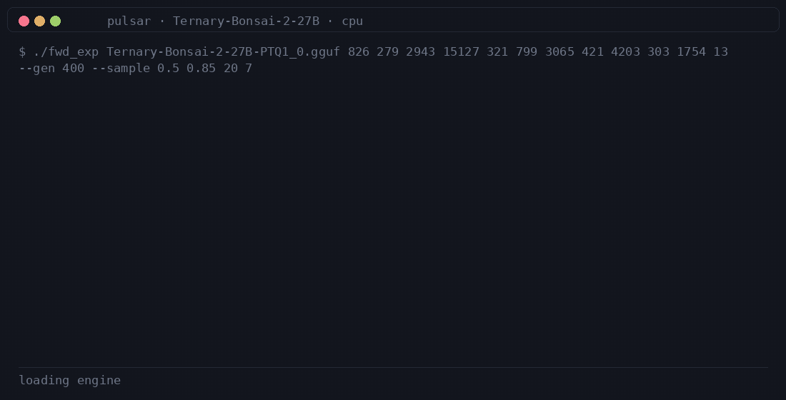
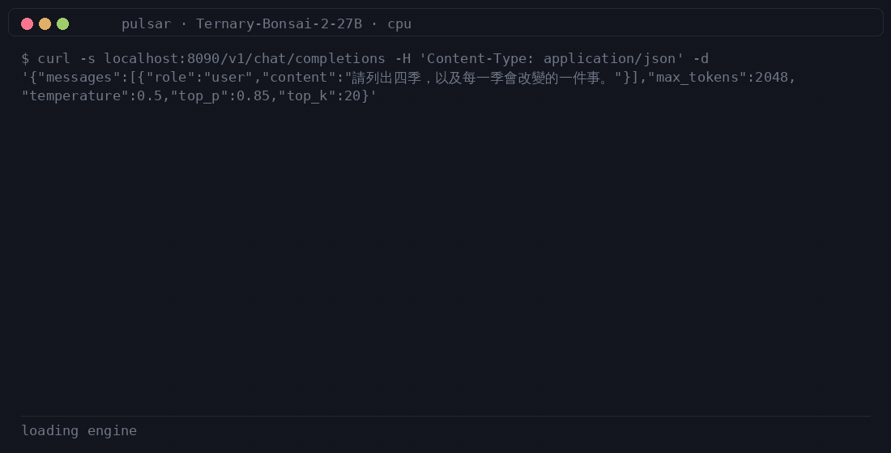

```sh
./fwd_exp Ternary-Bonsai-2-27B-PTQ1_0.gguf 826 279 ... --gen 400 --sample 0.5 0.85 20 7  # en
./fwd_exp Ternary-Bonsai-2-27B-PTQ1_0.gguf 99270 115992 ... --gen 400 --sample 0.5 0.85 20 123  # zh-TW
```

All four Bonsai clips are PULSAR-ASM engine bytes end to end (the
predecessor set ran the PrismML `llama.cpp` fork and is superseded): the
27B engine reproduces the fork server token for token at temp 0 (20/20 on
the probe prompt), the 8B phone binary reproduces the Spark engine
bit-for-bit including logits, and every clip reruns deterministically
from the seeded command shown in its title card. The Bonsai 1.7B/4B
checkpoints were evaluated and set aside over output quality. Both
responses and prompt ids are literals from those runs and re-render with the
same `make_chat_gif.py` command as the gemma clips below. The Traditional
Chinese clips ask the same four-seasons question; the 27B answers with a
compact table (7.5 tok/s) including its reasoning trace, while the 8B gives
a longer four-section list (4.0 tok/s) — each checkpoint's seeded sample
at its usual sampling, phone-shot for the 8B.

**K2-Horizon-0.9B** — 0.9B dense decoder (IFM, Llama arch), plain RMS norms,
YaRN rope, vocab 64256 — shown here in its **original** form and as a zh-TW
meeting-agent **fine-tune (FT)**. Both clips are the pure-assembly engine
(`pulsar_arm/k2horizon/k2_core.S`: `as` + `ld -static`, no libc, syscalls
only, glibc-bit-identical `expf`/`%.4f`) on the phone's big cores, greedy,
4-thread decode + 8-token prefill chunks; every frame is that run's own
bytes.

*Original* — the ceiling prompt is the two-sentence neural explainer
(seasons loops and haiku rambles under greedy, so they don't qualify).
13 tok/s.

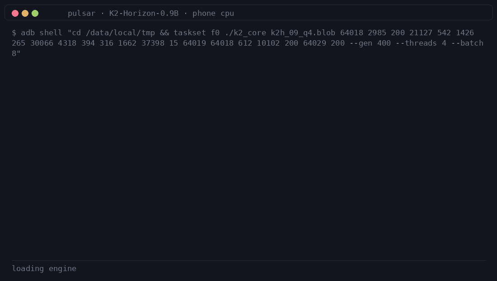

```sh
adb shell "cd /data/local/tmp && taskset f0 ./k2_core k2h_09_q4.blob 64018 2985 ... --gen 400 --threads 4 --batch 8"
```

*Fine-tune (FT)* — the same 0.9B trained for live meeting reading
(NOTE/REVISE/NEXT protocol), converted from the published int4-QAT
safetensors to our own Q4 blob and run on the same pure-asm engine (greedy,
so the clip is exactly reproducible). The clip shows the full 6-turn input
window verbatim so every NOTE/NEXT can be checked line-by-line — all five
notes cite genuine timestamps and the harness stops the turn at NEXT.
3.2 tok/s (the 680-token prefill dominates; 8-token chunks + 4 threads cut
it 2.6x). Given the same window the original model deliberates 150 tokens
without emitting a single NOTE — that behavioral gap is what the fine-tune
buys.

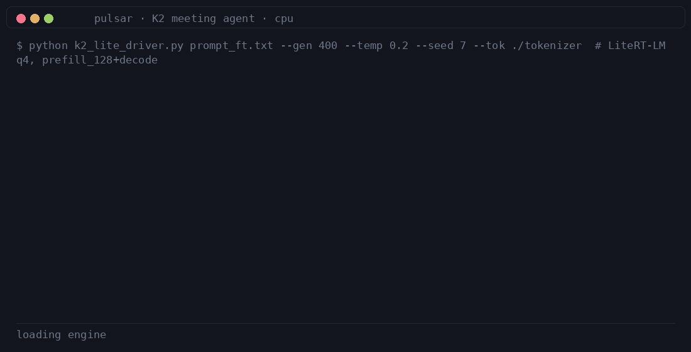

```sh
adb shell "cd /data/local/tmp && taskset f0 ./k2_core k2h_ft_q4.blob $(cat ft_ids680.txt) --gen 400 --threads 4 --batch 8"
```

Both K2 clips are real phone bytes and re-render with the same
`make_chat_gif.py` command. The same blobs on Spark are bit-identical to
the scalar C reference (`neural2.txt`), including the logits.

**gemma-3-1b-it** — each clip uses the most complex prompt the checkpoint
answers *correctly* (a four-item structured list, and a three-item one in
zh-TW), both complete and clean end to end:

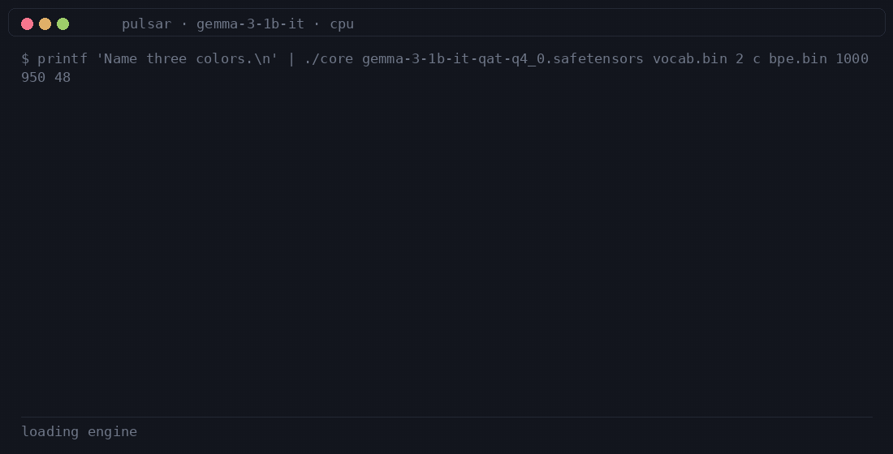
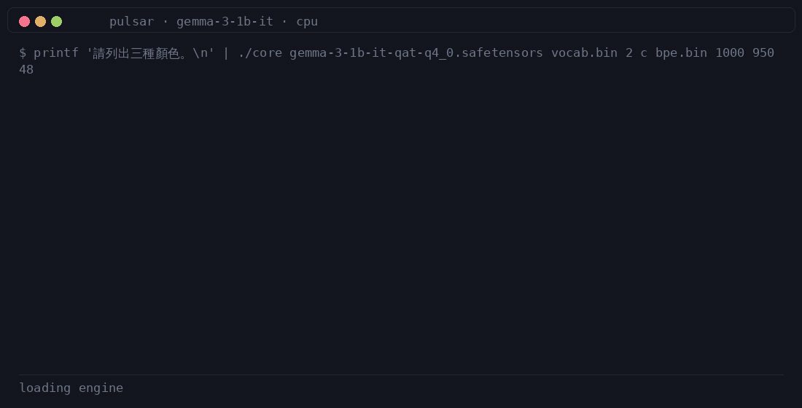

```sh
printf 'List the four seasons and one thing that changes in each.\n' | ./core gemma-3-1b-it-qat-q4_0.safetensors vocab.bin 2 c bpe.bin 1000 950 123
printf '請列出保持健康的三個要點。\n'                                | ./core gemma-3-1b-it-qat-q4_0.safetensors vocab.bin 2 c bpe.bin 1000 950 172
```

The gen caps above are tuned to end on the model's closing line (123 for the
English clip, 172 for the zh-TW one); the sampler is the checkpoint's
recommended configuration — temperature 1.0, top-k 64, top-p 0.95 — which is
what the engine implements.

**gemma-3-270m-it** — same binary, 18 layers:

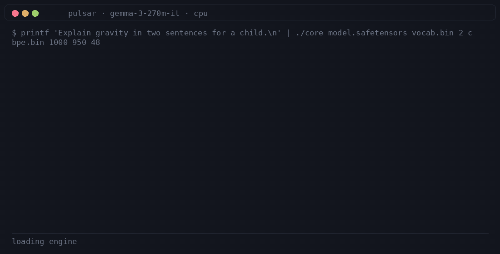
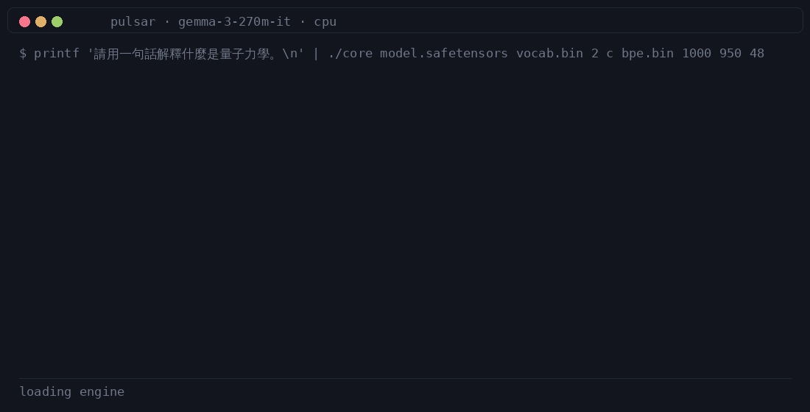

```sh
printf 'Explain gravity in two sentences for a child.\n' | ./core gemma-3-270m-it-qat-q4_0.safetensors vocab.bin 2 c bpe.bin 1000 950 48
printf '請用一句話解釋什麼是量子力學。\n'                 | ./core gemma-3-270m-it-qat-q4_0.safetensors vocab.bin 2 c bpe.bin 1000 950 48
```

**FunctionGemma-270m-it** — both an English and a Traditional-Chinese question
become the same tool call (one schema, only the user turn differs):

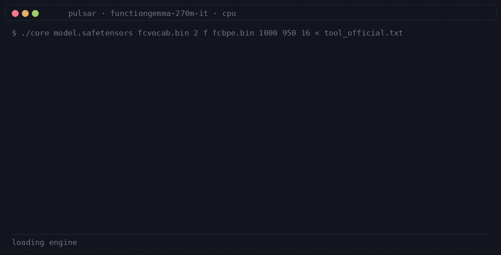
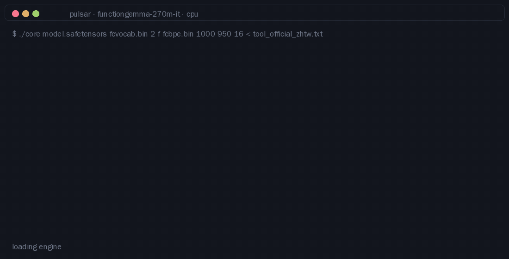

```sh
python3 pulsar_arm/tools/fc_write.py   # -> /tmp/tool_official.txt, /tmp/tool_official_zhtw.txt
./core functiongemma.safetensors fcvocab.bin 2 f fcbpe.bin 1000 950 16 < /tmp/tool_official.txt
./core functiongemma.safetensors fcvocab.bin 2 f fcbpe.bin 1000 950 16 < /tmp/tool_official_zhtw.txt
```

Re-render any subset with `python3 pulsar_arm/tools/make_chat_gif.py` (needs
PIL + ffmpeg); the transcripts are literals in that file, so a re-run can only
reproduce these frames, never invent them.

## Verified gates

- **Bonsai greedy parity.** 27B: 17-token stream exact vs the reference
  server at temp-0; 8B: 5/5 exact. Full top-20 distribution match at a
  sampled position (19/20 same ids, same order) — the engines' logits are
  the fork's logits, so sampling draws from the same distribution.
- **Bonsai kernels.** PTQ1_0 decoder, FWHT-1024, full 89M-weight projection
  and both NEON GEMVs bit-exact vs the fork (26.0 ms / 0.29 ns/w PTQ1_0,
  7.3 ms / 0.15 ns/w PQ2_0, single pinned core); GDN and both ropes at
  fp32-vs-op level. See `pulsar_arm/bonsai2/README.md` for the ledger.
- **HF-exact decode.** Greedy output is identical to transformers token for
  token: 32/32 bench tokens for both 270m (fp32) and 1B (bf16), and complete
  chat transcripts — 1B answers *"The capital of France is **Paris**."* exactly
  as HF does. The 270m residual also matches an fp64 oracle to ~1e-7 at every
  layer and every position.
- **One binary, header-driven dims.** `dims hid/inter/layers/vocab: 1152 6912
  26 262144` and `640 2048 18 262144` from the same build — hidden width,
  intermediate width, layer count, vocab, the folded-norm stride, every kernel
  dimension and the full-attention set (`i mod 6 == 5`) all come from the file.
- **BPE encode** 18/18 exact vs HF (char-level init, rank-order merges,
  leftmost tie-break, byte fallback).
- **Determinism.** Greedy, sampled and full chat transcripts reproduce
  bit-for-bit across runs at a fixed seed.
- **Robustness.** Empty / whitespace / CRLF input, 203-token prefill, 8-turn
  depth with automatic context reset, EOF and exit paths, gen-cap boundary.
- **asm at C parity.** GEMV reaches 3.88 GB/s using a single SHLL instruction
  for bf16 widening; the bit-identical wins the C port proved (fused
  elementwise passes, one layer body per call, precomputed tables) are present
  in the asm path too.

## Performance

- **Bonsai wall.** The 27B streams ~5.9 GB/token of ternary weights;
  single-core cost is ~7.6 s/token, OpenMP over GEMV rows brings it to
  ~0.71 s/token on 20 cores (bit-identical tops). The NEON integer kernel
  does 0.29 ns/weight (PTQ1_0) and 0.15 ns/weight (PQ2_0) — 5.3× and more
  over the scalar paths, which is what makes the port practical; the float
  path it replaced ran 153 ms per 89M-weight projection.
- **The wall.** A numpy streaming-sum ceiling of 3.93 GB/s was measured on this
  Pi. The driver moves 536 MB/token for 270m and 2.00 GB/token for 1B, i.e.
  3.6–3.9 GB/s depending on the run — the same bus saturation at both sizes,
  so the floor is ~136 ms/token for 270m and ~510 ms/token for 1B here.
- **Multi-core is not the answer.** A 3-thread static-partition GEMV is 4.2 %
  *slower* (same-job A/B, twice): the bus is already saturated.
- **Thermal drift.** Absolute numbers move 5–18 % between sessions; compare
  same-job A/B ratios, never absolutes.

## Layout

```
pulsar_arm/asm/core.S        the engine: mmap stage → kernels → layer forward
                             → sampler → BPE → chat / bench / file drivers
pulsar_arm/tools/            build-time converters (mkvocab, mkbpe, fc_write),
                             oracles (fwd_ref, l0_any, hf_greedy), the per-layer
                             debug probe patch, demo renderer
pulsar_arm/kernels, runtime  C reference path — parity oracle only, NOT shipped
pulsar_arm/bonsai2/          Bonsai ternary port (C + NEON, CPU-only): fwd/fwd8
                             engines, NEON GEMVs, FWHT asm, GGUF/tokenizer
                             tools, fork-graph oracle, own README + ledger
pulsar_arm/k2horizon/        K2-Horizon-0.9B port: pure-asm runtime (k2_core.S:
                             threaded decode + chunked prefill), Q4 converter,
                             fine-tune conversion, oracle + eval harness
pulsar_arm/tests/            parity tests (Pi-side, need torch + HF cache)
doc/                         demo GIFs and write-ups
```

## Disclosures

- The four Bonsai clips above run the reference runtime, not the in-tree
  port; they are presented as the checkpoints' ceiling behaviour at their
  own sampling, with transcripts verified programmatically against the run
  logs (never hand-typed). Engine-native re-renders are in progress.
- The 27B is a reasoning model: its raw stream opens inside `<think>`;
  clips show the answer content as the server renders it (reasoning kept
  out of frame, same convention).
- The 1B answers multi-item and explanatory prompts (see demos); the 270m
  manages one-line factual answers and degrades beyond that — checkpoint size,
  not the engine, whose greedy path is HF-identical for both.
- The chat path feeds `<bos>` separately on the first turn, so it is not part
  of the printed `tpl:` list; in file mode `<bos>` is literal text in the
  prompt file, so it is.
- Sampling above temp 0.7 stays coherent; greedy is the reference behaviour
  and what all parity claims use.
