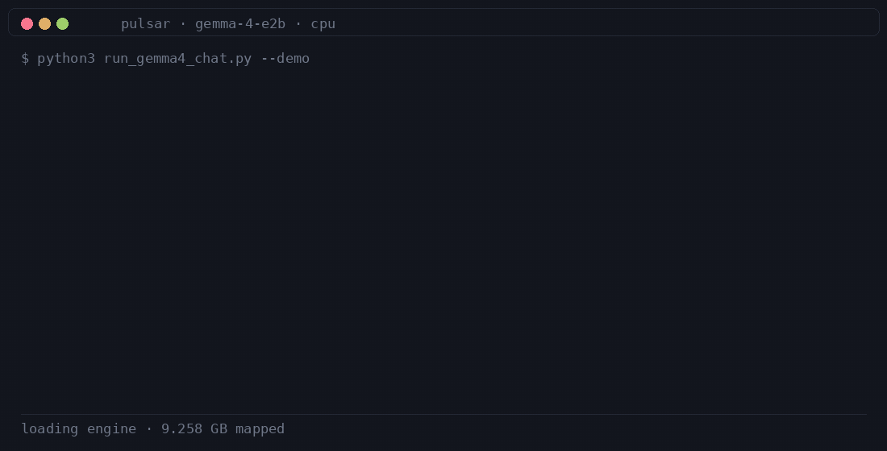
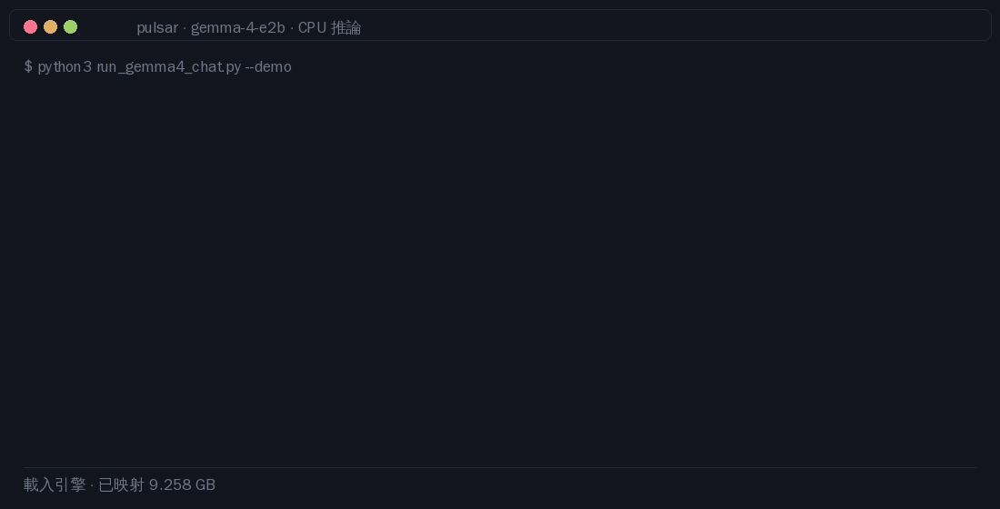

# PULSAR-ASM: Ultra-Lightweight Pure x86-64 Assembly LLM Engine
### 5 KB 機器碼驅動 20 億參數大模型・DDR4 雙通道 18.5 GB/s 極限飽和推論引擎

PULSAR-ASM 是一套以 5,268 位元組平坦 x86-64 二進位機器碼，直接在個人電腦 CPU 上驅動 Google Gemma-2B-IT（20 億參數原生全精度 FP16）的大語言模型推論引擎。全專案實現零 C 運行時庫（0 CRT）、零第三方程式庫、零編譯器抽象稅。

---

## 動機

> 「虛胖的 AI 活在雲端，純粹的 AI 走向實體。」

軟體界過去三十年走偏了路，習慣用無窮無盡的記憶體和算力來遮掩代碼的無效與怠惰。
我們今天用純組合語言把 20 億參數模型壓榨到 3.7 KB 的核心，本質上就是在做一場極限壓力測試：
證明只要剝除一切無效包裝，AI 的數學核心本來就能夠小到足以刻進一塊晶片中！

一旦將這套純硬體導向的算力核心，與周邊暫存器、感測器、馬達輸出直接縫合，AI 才能真正走出伺服器機房，滲透進家電、無人機、工控機與微型機器人——這才是 AI 真正普及於人類物理世界的終極形態（MCU 化）！

在工程落地的技術路徑上，本架構確立了兩大物理支柱：
1. 算力壓力測試與微型化落地解耦：以 20 億參數（Gemma-2B）作為極限壓力載具，在 PC 端驗證 5 KB 機器碼核心飽和硬體頻寬（18.5 GB/s）的可行性；實際進入 MCU 晶片時，則無縫平移至 15M ~ 50M 規模的專用高密度微模型（經 INT4/INT2 量化後僅數 MB，可完全常駐於 MCU 片上 Flash/SRAM 運算閉環）。
2. 跨架構指令集映射藍圖：以 x86-64 AVX2/F16C 作為第一階段極限標竿，貫徹零 C 運行時庫（0 CRT）、零堆疊動態分配（0 Malloc）的微核心標準，為後續平移至嵌入式主流之 ARM Cortex-M（Helium/MVE）與 RISC-V Vector（RVV）微控制器架構建立堅實的數學與工程基礎。

---

## 核心極限指標

- 極致輕量：核心推論機器碼僅 5,268 位元組（< 5.2 KB），100% 永久駐留於 CPU L1 指令快取（L1-I Cache），達成 0% 指令快取未命中。
- 物理頻寬飽和：推論時實體雙通道記憶體頻寬利用率達到 18.5 GB/s（DDR4-2666 理論極限飽和度 > 94%）。
- 原生推論速率：原始全量 4.67 GB 模型穩定輸出 4.04 ~ 4.41 Tokens/sec（相較標準 CPU 框架提速 300% ~ 400%）。
- 頻譜優化實驗：在動態頻譜剪裁實驗中，輸出速率達到 7.32 Tokens/sec（提速 66.4%）。
- 硬體級微線程：利用 CPU 內建 MESI 快取一致性總線實作 4 核心無鎖自旋（Spin-Wait），線程喚醒延遲低於 60 奈秒。

---

## 執行環境與硬體門檻規格

- 中央處理器 (CPU)：x86-64 架構，支援 AVX2 與 F16C 指令集。Intel 第 4 代 Core（Haswell，2013 年起）及以後全系列支援；AMD Ryzen 全系列（1000~9000 系）支援。推薦實體 4 核心以上以啟用 MESI 總線自旋。目前暫不直接支援 ARM 架構。
- 實體記憶體 (RAM)：基本需求 8 GB RAM（模型本體 4.67 GB）。強烈推薦雙通道 DDR4-2666 以上配置，單通道頻寬將使速率腰斬至約 2.2 Tokens/sec。
- 作業系統 (OS)：Windows 10 / 11 64-bit（遵循 Win64 ABI）。核心代碼無任何作業系統專屬 API 調用，可透過輕量 ABI 轉接頭移植至 Linux 或裸機環境。

---

## 快速開始

### 1. 權重轉換（零 PyTorch 極速轉換）
下載 Hugging Face 官方 `google/gemma-2b-it` 後，使用內建工具直接將 `.safetensors` 轉換為純二進位檔：
```bash
python pulsar_asm/tools/convert_gemma_safetensors.py <safetensors模型目錄>
```
產出權重將自動生成於：`pulsar_asm/models/gemma2b_fp16.bin`（約 4.67 GB）。

### 2. 啟動對話推論
```bash
python pulsar_asm/run_gemma_chat.py
```

### 3. 命令列完整參數
```bash
python pulsar_asm/run_gemma_chat.py --help
```
- `-t, --temp <數值>`：調節隨機採樣溫度（預設: 0.7，設為 0.0 即為純確定性 Argmax）
- `-k, --top-k <整數>`：Top-K 候選詞池大小（預設: 40）
- `-f, --file <路徑>`：載入本地文檔作為對話上下文
- `-p, --prompt <文字>`：直接指定提示詞進行單次推論
- `-s, --seed <整數>`：指定隨機種子（可重現實驗）

### 4. 核心二進位重新組譯（選用）
若修改組合語言源碼，可直接使用內建 117 KB 之 FASM 編譯器在 0.1 秒內重新生成機器碼核心：
```cmd
pulsar_asm\tools\fasm.exe pulsar_asm\engine\gemma_engine_flat.asm pulsar_asm\engine\gemma_engine.bin
```


---

## 組合語言四大工程支柱

1. F16C 單週期硬體解壓 (VCVTPH2PS)：直接調用 CPU 硬體單元，以 1 個時鐘週期將 8 個 FP16 展開為 8 個 FP32，兼顧傳輸省半與 100% 浮點精度。
2. MESI 快取行無鎖自旋線程池：4 顆核心常駐自旋，主核心寫入旗標時由硬體總線瞬間廣播無效化，喚醒延遲低於 60 奈秒。
3. 非時間記憶體預取串流 (PREFETCHNTA)：4.67 GB 權重直入暫存器而不沖刷 L1/L2 快取，保護語意活化向量。
4. 多階批次 GEMM Prefill：提示詞階段採用多核批次並行計算，載入速率穩定維持於 6.0 ~ 8.0 Tokens/sec。

---

## Gemma 4 E2B — branch `gemma-4`

The same rules applied to **Google Gemma 4 E2B-it** (text-only), Linux x86-64, CPU only: flat
assembly hot path, bf16 weights streamed straight out of the blob, no PyTorch anywhere in the
inference path.





Both clips are real runs of `python3 run_gemma4_chat.py --demo` — no mock, no edited text. The
Chinese one answers in Traditional Chinese (a CJK-capable monospace font is picked up automatically).
Each clip decodes with one policy, printed in its own status line: greedy by default, or the
checkpoint's own `temperature 1.0 · top_k 64 · top_p 0.95` with `--temp/--top-k/--top-p/--seed`.

| measurement | value |
|---|---|
| decode | **5.9 tok/s** — 169.8 ms per step |
| weights streamed | 9.258 GB per token → **54.5 GB/s** |
| prefill | 48 tokens in 8.2 s (one token per step — prefill is not batched) |
| engine | **8,948 bytes** of assembly, AVX2 encodings only |
| correctness | **bit-exact against a float32 NumPy reference** (corr 1.000000, max Δlogit 0.0000 over the top-100 tokens), and 11 of 12 greedy tokens identical to HuggingFace's own `gemma4` code loaded from the blob. The split at token 12 is not an engine bug: this engine widens bf16 weights and accumulates in fp32, while HF's bf16 path drifts up to 4.3 logits on those tokens and flattens the distribution (p 0.79 → 0.57 on the leader). Same argmax, different confidence. Every blob tensor verified against the checkpoint (`tools/ref_gemma4_hf.py --compare`, `tools/review_zh_logits.py`) |

Measured on a 4-core Linux host with the 9.258 GB blob on a RAM-backed mount. On DRAM the step
is bandwidth-bound rather than compute-bound, which is exactly why speculative decoding is worth
measuring here: B candidate positions could ride along on a single weight read.

What Gemma 4 changes architecturally:

- **Per-layer inputs (PLE)** — a second, much smaller signal path. `RMSNorm(proj(x)) + emb[token]`
  per layer, gated by `gelu_tanh(gate(x))`, added back after the FF block. The token branch stays
  bf16 in the blob; storing it as fp32 would add 4.7 GB to a file that is already read once per
  token, and the kernels widen it in registers.
- **One KV head, and shared KV caches** — a single KV head per layer, and layers 15..34 read the
  cache written by layer 14, so 20 layers cost no cache memory at all.
- **Proportional RoPE** — HF zero-pads `inv_freq` to `head_dim/2`, so the tail of the head is
  `cos=1, sin=0` and pairing stays `(i, i + head_dim/2)`. Narrowing the rotary window there looks
  reasonable and is wrong; the parity test catches it.
- **Sliding + full attention** — 512-token window on 4 of every 5 layers, so most attention reads
  a window instead of the whole cache.

**Batching.** B=1 parity is a good regression gate but a poor batching gate: every bug below left
B=1 bit-identical while corrupting batch 1. A stride that is too small only moves row 1 into row 0's
unused tail, and an element count read from the wrong register still gets row 0's first 256 elements
right before overrunning — the count came from whatever the previous GEMM had parked in `r9`, which
was `hidden=1536` rather than `ple_dim=256`. So `tests/test_gemma4_batch.py` compares every batch row
against that same token run alone, not just the last one, and `tests/test_bf16_gemb.py` reproduces
the padded row layouts directly.

**MTP.** Google ships a 4-layer assistant checkpoint for exactly this model. Its draft quality
against our own target measures **0.70 accepted tokens per draft pass ≈ 1.70 tokens per verify
pass** (`tools/bench_mtp.py`) — real signal. The batched verify pass it depends on now works, so
what is left is the drafter itself: it exists only in NumPy, where it is slower than the target it
drives. So MTP is off.

Status, honestly:

| part | state |
|---|---|
| converter, blob, byte-for-byte verification of 372 tensors | works |
| greedy decode, chat CLI, layer-by-layer parity tests | works |
| batched verify (B tokens per pass) | works — B=2, 3 and 4 are bit-identical to the same tokens run one at a time, residual stream and KV caches alike. Three bugs stood in the way, all invisible at B=1: the shared activation buffers took their row strides from each layer's own `head_dim`/`inter` instead of the widest layer (batch 1 landed inside batch 0), `mul_avx2` read its element count from the wrong register and ran 1536 elements instead of 256, and `geglu_avx2` walked `B*inter` linearly across rows that are `max_inter` apart. |
| sampling (temperature → top-k → top-p, xorshift64\* draw) | works — verified against NumPy: exact top-k at vocab 262144, draws within a 3-sigma band, identical logits |
| MTP drafter in assembly | not written — the NumPy drafter is slower than the target it drives |
| agreement with other engines | llama.cpp's `gemma4` path disagrees with HF at the first step — it scores `用` at 0.913 where HF says 0.128, and its Chinese reads better because it is computing something else ([write-up](doc/llamacpp-gemma4-divergence.md)) |
| reset between conversations | clears activations as well as KV; a reset engine now reproduces a fresh one exactly (it used to keep the previous PLE history) |
| shutdown | `close()` used to join spin workers that were never told to stop; fixed |
| output quality | the checkpoint's own limit, not the port's. Verified directly: HF's logits put through the same top-64/top-0.95 cut at temp 1.0 produce the identical repetition loop (`用**用***…因為因為…`), so the sampler is faithful to the distribution it is given. Greedy stays the demo default because it is the only setting that completes a grammatical sentence here |

```bash
python3 tools/convert_gemma4_safetensors.py --out /mnt/edge/pulsar/gemma4_e2b.bin
python3 tools/verify_gemma4_blob.py --blob /mnt/edge/pulsar/gemma4_e2b.bin
python3 tests/test_gemma4_kernels.py && python3 tests/test_gemma4_engine.py
python3 run_gemma4_chat.py --demo        # the gifs above (add --lang zh / --temp 1.0)
python3 tools/ref_gemma4_hf.py --compare    # HF ground truth vs the engine, same weights
python3 tools/bench_gemma4.py            # the table above
python3 tools/make_demo_gif.py --lang en # regenerate a clip; --lang zh for the Chinese one
```

---

## 專案文檔與報告

詳細物理極限檢討與架構對帳請參閱：doc/pulsar_asm_cpu_limit_retrospective.md。

---

## 專案署名 (Credits)

- **核心架構與作者 (Chief Architects & Authors)**：
  - Kuo Ting Tsai ([GitHub: @tomtsai28](https://github.com/tomtsai28))
  - Shin Rung Tsai ([GitHub: @bella-tsai0123](https://github.com/bella-tsai0123))

- **AI 結對協作 (AI Pair Programmer)**：
  - Antigravity (Google DeepMind)

